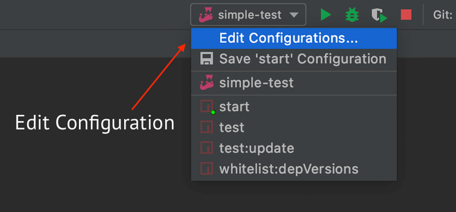
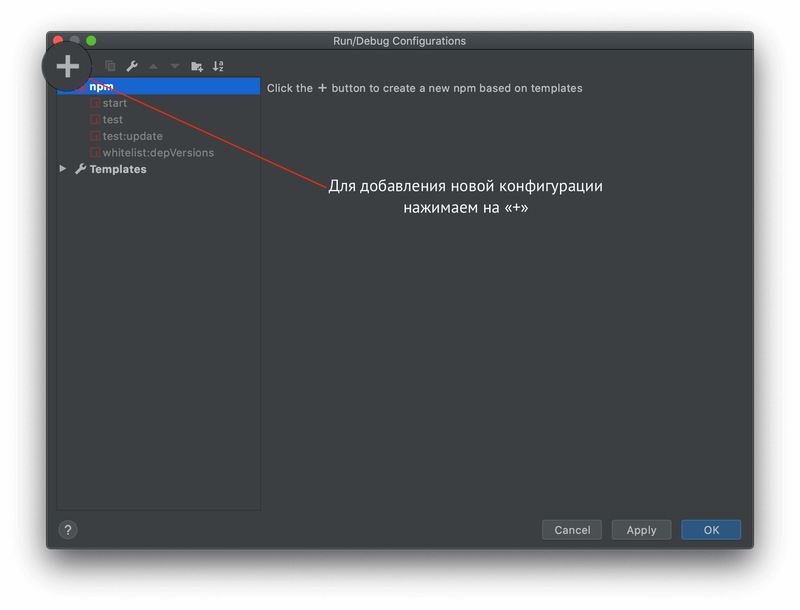
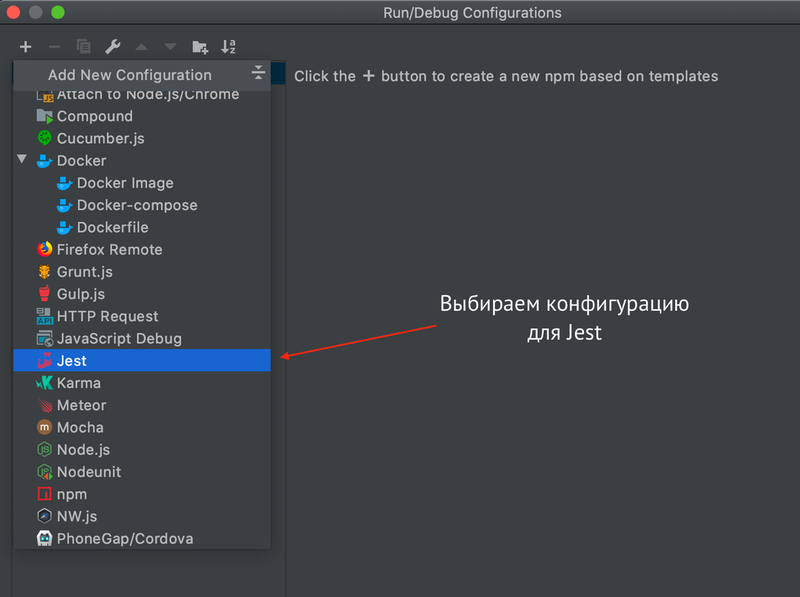
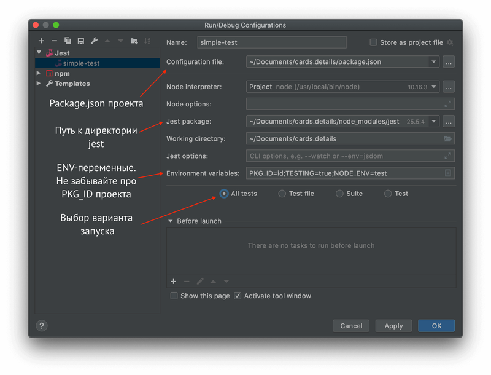
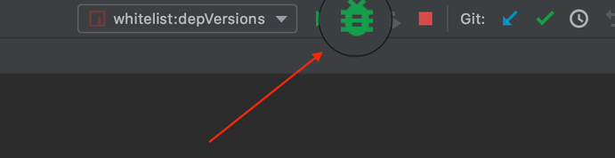

# Jest-пресет СБОЛ

Пакет содержит пресет для jest, позволяющий быстро настроить фреймворк для работы с платформенными библиотеками и инструментами

<br />

## Требования к проекту

* @sbol/webpack-config: ~12.2.4

<br />

## Миграция

[Инструкция по миграции между версиями](./MIGRATION.md)

<br />

## Список изменений

[Список изменений по версиям](./CHANGELOG.md)

<br />

## Подключение

В вашем `package.json`:
```json
{
    "devDependencies": {
        "@sbol/jest-config": "~1.4.0"
    },
    "scripts": {
        "test": "cross-env NODE_ENV=test TESTING=true jest --ci --coverage",
        "test:update": "npm run test -- -u"
    },
    "jest": {
        "preset": "@sbol/jest-config"
    }
}
```

<br />

__Важно!__

По умолчанию jest берет имя вашего проекта из поля name в package.json, удаляя префикс `@sbol/`, но,
если вы хотите задать его вручную, то это можно сделать посредством добавления переменной `PKG_ID` в скрипт запуска тестов. 

Обратите внимание на значение переменной `PKG_ID=YOUR_PKD_ID`, она должна содержать id вашего проекта
без префикса `@sbol/`

<br />

Пример для проекта `catalog`:
```json
{
    "devDependencies": {
        "@sbol/jest-config": "~1.4.0"
    },
    "scripts": {
        "test": "cross-env NODE_ENV=test TESTING=true jest --ci --coverage",
        "test:update": "npm run test -- -u"
    },
    "jest": {
        "preset": "@sbol/jest-config"
    }
}
```

Пример для проекта `catalog` с определением иного имени проекта `potolok`:
```json
{
    "devDependencies": {
        "@sbol/jest-config": "~1.4.0"
    },
    "scripts": {
        "test": "cross-env NODE_ENV=test TESTING=true PKG_ID=potolok jest --ci --coverage",
        "test:update": "npm run test -- -u"
    },
    "jest": {
        "preset": "@sbol/jest-config"
    }
}
```

<br />
<br />
<br />

## Добавление/переопределение моков

Для добавления/переопределения мока проектных зависимостей используйте секцию moduleNameMapper:
```json
{
    "jest": {
        "moduleNameMapper": {
            "@sbol/lib.app": "<rootDir>/src/__mocks__/lib.app.jsx"
        }
    }
}
```

Пропатчить стандартный мок, к примеру lib.app, содержащийся в jest-config, можно следующим образом:

```js
// Добавляем файл как описано выше в папку вашего проекта - <rootDir>/src/__mocks__/lib.app.jsx
// Импортируем стандартный мок lib.app из jest-config'a
import { createLibAppMock } from '@sbol/jest-config/test/__mocks__/lib.app'

const mockLauncherModules = {
    settings: {
        featureFoo: {
            value: 'true',
            options: null
        }
    }
}

// Экспорт с вашими stub'ами без переопределения мока
module.exports = createLibAppMock({ modules: mockLauncherModules })
```

При этом любую часть мока можно пропатчить отдельно

```js
// Экспорт с вашими stub'ами с переопределением мока
import { createLibAppMock } from '@sbol/jest-config/test/__mocks__/lib.app'

// Пример 1 - Переопределяем метод getFeatureValue
module.exports = {
    ...createLibAppMock({ modules, config, navigation }),
    getFeatureValue: () => {
        // Переопределённая вами реализация метода
    }
}

// Пример 2 - Меняем реализацию метода createUrl компонента Link
const defaultLibAppMock = createLibAppMock({ modules, config, navigation })

// Переопределение метода компонента Link
defaultLibAppMock.Link.createUrl = (key) => `plUrl/sbtsbol/private/${_.replace(key, /\./g, '/')}`

// Возвращаем пропатченный объект
module.exports = defaultLibAppMock
```

Стандартные моки можно посмотреть в папке `jest-config/src/__mocks__`

<br />
<br />
<br />

## Переопределение других опций

Также можно расширять / модифицировать конфиг, добавляя в секцию `jest` директивы.
К примеру, для React 15 конфиг может быть дополнен следующим:
```json
{
    "testEnvironmentOptions": {
        "enzymeAdapter": "react15"
    }
}
```

Или, к примеру, уменьшить охват файлов jest'ом для файлов, которые не нужно тестировать

```json
{
  "testPathIgnorePatterns": [
      "/node_modules/",
      "src/components/file-to-exclude.jsx"
  ]
}
```

Или наоборот - только те, которые необходимо тестировать (в примере указаны настройки по-умолчанию)

```json
{
  "collectCoverageFrom": [
    "**/src/**/*.{js,jsx}"
  ]
}
```

<br />
<br />
<br />

## Настройка запуска

Первый способ - зайти в настройки через меню

`WebStorm` > `Main menu` > `Run` > `Edit Configuration...` > `Add New Configuration` > `+` > `Jest`

<br />

Второй способ - кликнув на конфигурацию в правом верхнем углу экрана <br/>

<br/>
<br/>
<br/>
<br/>

Появится окно настройки: <br/>


- Name: `simple-test`
- Configuration file: `package.json`
- Jest package: `pkg_id/node_modules/jest`
- Working directory: `pkg_id`
- Environment variables: `NODE_ENV=test; TESTING=true PKG_ID=pkg_id вашего проекта`
- Режим запуска `All tests`

Сохраняем настройки и нажимаем на иконку "Жука" в правом верхнем углу экрана <br/>



[Подробнее про debug](https://blog.jetbrains.com/webstorm/2018/01/how-to-debug-with-webstorm/)

<br />
<br />
<br />

## Документация

Для более подробного изучения jest api можете перейти по ссылке - [Документация Jest](https://jestjs.io/docs/en/getting-started)

Для того, чтобы jest "увидел" ваши тесты, нужно рядом (не обязательно, но желательно, для структурированности) с тестируемым файлом
создать папку `__tests__`.

Можно задать и другие имена папок с тестами при помощи конфига (ниже), но лучше, во избежание коллизии, придерживаться рекомендациям ([подробнее почему с двумя подчёркиваниями](https://github.com/facebook/jest/issues/637))

```json
{
    "jest": {
      "testMatch": ["**/tests/**/*.js"]
    }
}
```

Имена файлов внутри папок `__test__` должны иметь названия, содержащие testName.spec.js, либо testName.test.js, либо .jsx (для тестирования компонентов)

Каждый тестовый сценарий должен быть обернут в блок ```test```(ранее ```it```, работает, сохранен для совместимости), который в свою очередь, оборачивается в блок ```describe```.
Это делается для более явного разграничения тест-кейсов (обычно в ```describe``` оборачивают блок, который тестирует определенный набор сценариев, например, все, что относится к конкретному компоненту, его utils и т.д.)

<br />
<br />
<br />

## Примеры

Примеры тестов можно найти в папке `jest-config/src/__tests__/`

Краткая справка по используемым методам:

```shallow``` - метод библиотеки enzyme, отвечающий за рендер компонента ([подробнее про api enzyme](https://airbnb.io/enzyme/docs/api/)) <br/>
```expect``` - глобальная функция jest проверяющая соответствие ([подробнее про jest globals](https://jestjs.io/docs/en/api)) <br/>
```toMatchSnapshot``` - функция, проверяющая снапшот на соответствие (подробнее смотрите секцию "Снапшоты" ниже) <br/>

<br />
<br />
<br />

## Снапшоты

Для тестирования react-компонентов jest использует так называемые снапшоты(генерируемые файлы-снимки в json-формате). ([подробнее про снапшоты](https://jestjs.io/docs/ru/snapshot-testing))

Примеры снапшотов можно найти в папке `jest-config/src/__tests__/__snapshots__`

Чтобы обновить существующие снапшоты после изменения в компоненте, выполните команду ```npm run test -- -u```
(флаг ```--``` нужен для того, чтобы следующий за ним флаг ```-u``` попал в команду ```jest```, скрытую в скрипте ```test```)
<br>
```json
{
  "scripts": {
    "test:update": "npm run test -- -u"
  }
}
```

<br />
<br />
<br />

Приятного пользования. Любите jest - используйте jest!

Дополнения и рекомендации - welcome! Пишите авторам репозитория 🤓
