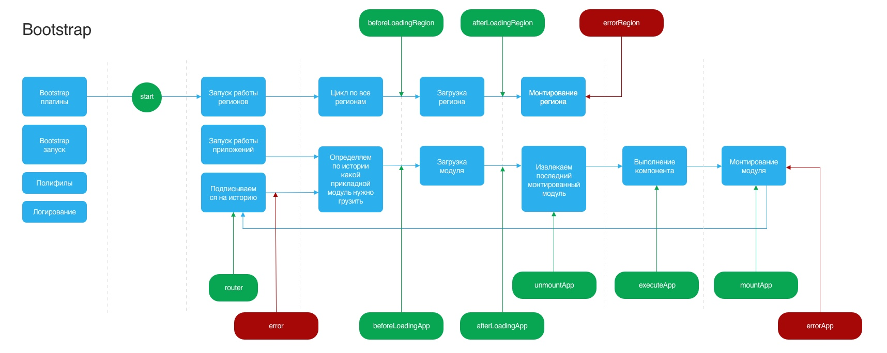

# Bootstrap
Загрузка модулей и построение роутинга для сервисов CБОЛ

# Конфигурации

- isErib (Boolean) - не отображается лоадер, блокирует отображание ошибки в конетнетной части
- api.init.disabled (Boolean) - блокирует вызов запроса api/init

# Launcher

## Feature:

### BootstrapLoader
Отображение приветственного окна

### BootstrapEntryURLRedirect
Идентификатор модуля после приветственного окна

### BootstrapLoaderMinTimeout
Минимальное время жизни приветственного окна

### BootstrapLoaderMaxTimeout
Максимальное время жизни приветственного окна

### CMSRoot
Контекст content-broker

### BootstrapOnBoarding
Отображение путеводителя по дизайну 3.0


# API

## @sbol/webpage.provider.bootstrap

При вызове глобальной функции bootstrap создается модуль `@sbol/webpage.provider.bootstrap`

### Работа с конфигурациями

----

### getOptions(selectors: [], defaultValue: string)

Возвращает значение по navigation, messages, config из PL Middle по селектору

Пример: 
```
getOptions(['config', 'res.url'])
```

### getInitOptions(pkg: string, selectors: [], defaultValue: string)

Возвращает значение из сервиса api/init. Внимание! Конфигурации хранятся в отдельной коллекции и пополняются после запроса на api/init

Пример: 
```
getInitOptions('cards.details', ['options', 'special.foo.bar'])
```

### Работа с Launcher конфигурациями

----
### getAllFeatures(pkg: string)
Возвращает все фичи по идентификатору модуля

### getFeature(pkg: string)
Возвращает фичу по идентификатору модуля

### getFeatureValue(id: string, pkg: string)
Возвращает значение фичи

### getFeatureOption(id: string, pkg: string)
Возвращет опцию из фичи

### getAllOptions: (pkg: string)
Возвращет все опции


### getOption(id: string, pkg: string)
Возвращет опцию 


----

### getPrefetch(id)
Возвращает префетч данные. Клиенту возвращаются данные в странице html свойство data.  

### getAppStartLoader()
Стартует верхний зеленый лоадер 

### getAppStopLoader()
Останавливает верхний зеленый лоадер

### getHistory()
Возвращает browser history

### getBroker()
Возвращает Message Bus

### getNotFound()

Возвращает 404 ошибку

## Система плагинов



TODO: описать словами